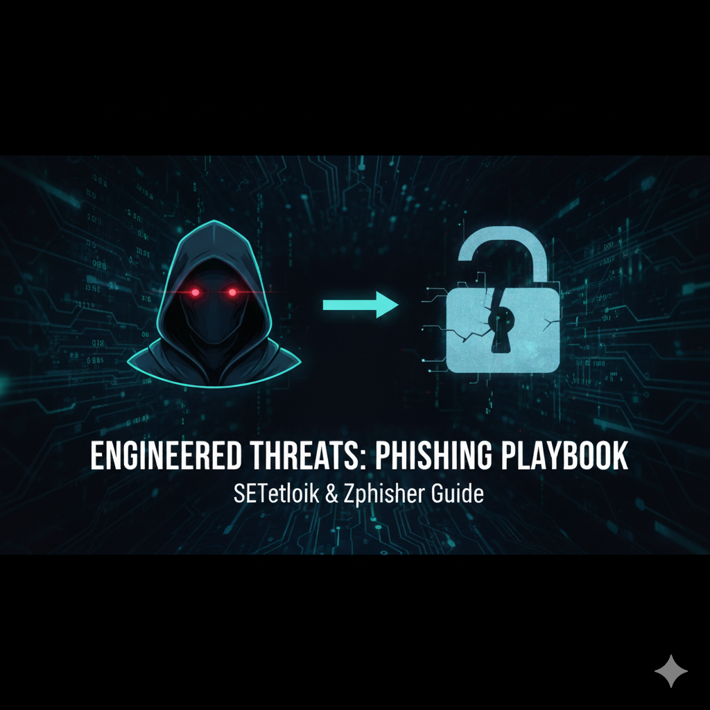

# 🎣 Guía Práctica de Ingeniería Social y Phishing: Simulación con SEToolkit y Zphisher

---

## 📖 Introducción

La **Ingeniería Social** es reconocida universalmente como el vector de ataque más eficaz, explotando el factor humano para obtener acceso a sistemas e información sensible.

Este repositorio alberga una **guía práctica y educativa** que tiene como objetivo desmitificar y exponer las técnicas más comunes de *Phishing* mediante la **simulación de ataques de Recolección de Credenciales**. El propósito principal es evaluar, de forma controlada, la **resistencia de los sistemas y del personal** ante amenazas reales.

A lo largo de esta guía, exploraremos la funcionalidad y el uso de herramientas clave de la industria como **SEToolkit** y **Zphisher**, detallando sus mecanismos de operación para que puedas desarrollar y aplicar **estrategias de mitigación efectivas** en un entorno profesional.

---

## ⚠️ Descargo de Responsabilidad (Disclaimer)

**Este material se proporciona estrictamente con fines educativos, de investigación y para pruebas de seguridad éticas (*ethical hacking*).**

El autor de este repositorio **no se hace responsable** del uso indebido, ilegal o malicioso que se le pueda dar a la información aquí contenida. Cualquier uso de las herramientas y técnicas descritas debe realizarse **únicamente** en sistemas propios, laboratorios virtuales o con el **permiso explícito y por escrito** del propietario de los sistemas objetivo. La realización de actividades no autorizadas es ilegal y va en contra del propósito ético y educativo de este repositorio.

---
